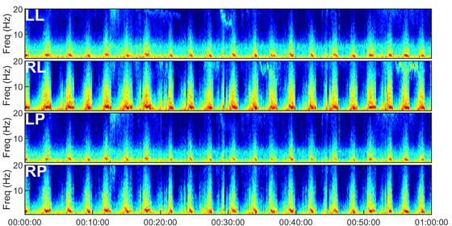

# HMS - Harmful Brain Activity Classification

[Challenge Link](https://www.kaggle.com/competitions/hms-harmful-brain-activity-classification)

[Variable Description Link](https://docs.google.com/spreadsheets/d/1YQVs89pAXDtdoIE6Exb0LL8spjBac2ubjy1KlcUxBQs/edit?usp=sharing)

## Description of Challenge
"The goal of this competition is to detect and classify seizures and other types of harmful brain activity. You will develop a model trained on electroencephalography (EEG) signals recorded from critically ill hospital patients.

Your work may help rapidly improve electroencephalography pattern classification accuracy, unlocking transformative benefits for neurocritical care, epilepsy, and drug development. Advancement in this area may allow doctors and brain researchers to detect seizures or other brain damage to provide faster and more accurate treatments."

The challenge at hand focuses on revolutionizing neurocritical care through the application of machine learning to electroencephalography (EEG) signal analysis. We are tasked with developing an algorithm capable of detecting and classifying various brain activities, including seizures and other potentially harmful patterns, observed in critically ill patients. This endeavor holds immense significance in the medical field, as EEG is a pivotal tool used by physicians to monitor brain activity, especially in patients with acute neurological conditions. Currently, EEG analysis predominantly relies on manual interpretation by specialized neurologists, a process that is not only time-consuming but also prone to human error and inconsistency.

The competition, hosted by the Sunstella Foundation in collaboration with Persyst, Jazz Pharmaceuticals, and the Clinical Data Animation Center (CDAC), offers an opportunity to create a transformative solution for EEG pattern classification. The data provided for this challenge includes EEG signals annotated by experts, classified into six key patterns: seizure (SZ), generalized periodic discharges (GPD), lateralized periodic discharges (LPD), lateralized rhythmic delta activity (LRDA), generalized rhythmic delta activity (GRDA), and an "other" category. These annotations come in three types: 'idealized' patterns with high expert agreement, 'proto patterns' with mixed classifications, and 'edge cases' with divided expert opinions. The success of this challenge promises to expedite and refine the diagnosis and treatment processes in neurocritical care, contributing significantly to advancements in medical research and patient outcomes in the field of neurology.

## Organisations

- [Harvard Medical School](https://hms.harvard.edu/) A preeminent institution of medical education and research, renowned globally for its advanced academic rigor, groundbreaking discoveries in healthcare, and commitment to shaping the future of medicine through its distinguished faculty, diverse student body, and extensive network of hospitals and research centers.

- [Critical Care EEG Monitoring Research Consortium (CCEMRC)](https://www.acns.org/research/critical-care-eeg-monitoring-research-consortium-ccemrc) Provided the labels for model training and evaluation, and to others who contributed to the scientific work that enabled this competition.

## Team
- Shaw Chifamba - (Lead, Machine Learning/Stats Analysis) [ LinkedIn](https://www.linkedin.com/in/shawbc/)
- Kacper Buksa - (Data Analytics) [ LinkedIn](https://www.linkedin.com/in/kacper-buksa/)
